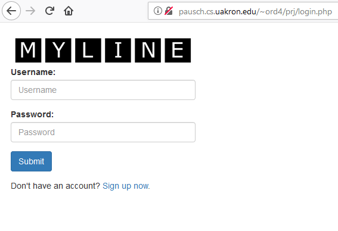

# MyLine - An Interactive Timeline Editor
Internet Systems Programming term project by Orion Davis and Tim Synder

### Introduction
MyLine is an interactive editor that allows uers to edit and view their own custom made timelines.  This application can be used to detail event itineraries, historical events, or other times where a timeline makes communication simple.  The application can be found on Pausch at the link <a href="http://pausch.cs.uakron.edu/~ord4/prj/login.php">http://pausch.cs.uakron.edu/~ord4/prj/login.php</a>.

### Implementation
To implement MyLine the back end server logic was written using PHP and MySQL Database.  The database lives on The University of Akron's servers for students and requires a university connection to properly connect to the database (it should also be noted that a university connection is also needed to use the application on Pausch).  For the front end HTML was used to display the data and was then styled using CSS.  Within the front end is the editor and to handle the operations of the editor JavaScript was used.

The database is a table which contains the user's account information.  This information includes an id number, username, hashed password and timeline data.  The timeline data is stored in JSON format which can easily by processed by the application to render the timeline for the user's viewing.  When buttons are pressed by the users requests are sent to the server for processing.  In the case of registion and logging in the primary function is to interact with the database and either add a new entry or query the database and look for the user.  

The front end uses HTML and CSS to provide the interface to the user.  Most of the editor's functions are handled local to the client through JavaScript, but when the user is ready to save their timeline the information gets sent to the database.  *TODO: Add more to this section*

### Screenshots
Below are a series of screenshots of the application's different pages and interfaces.
