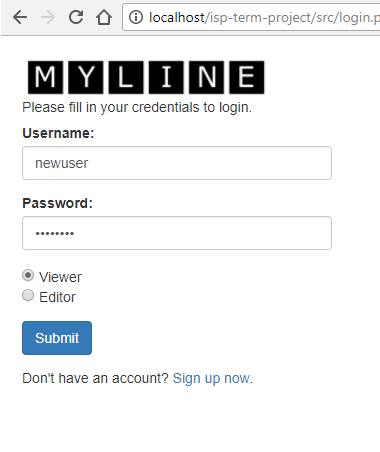
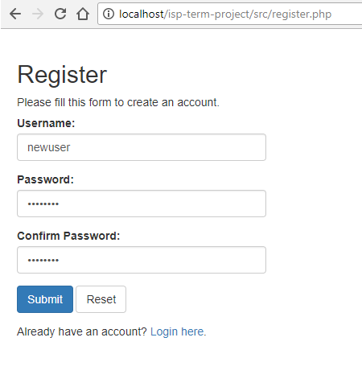
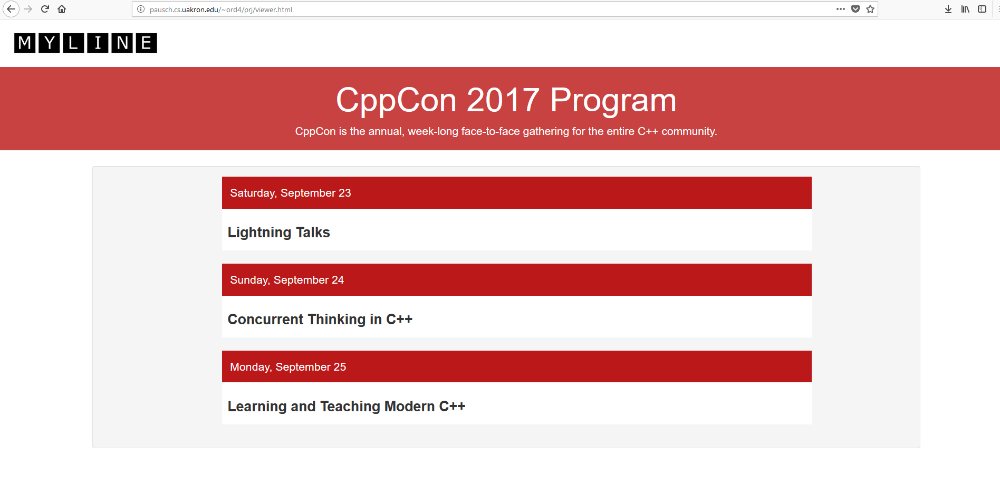
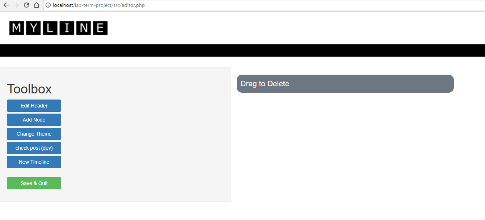
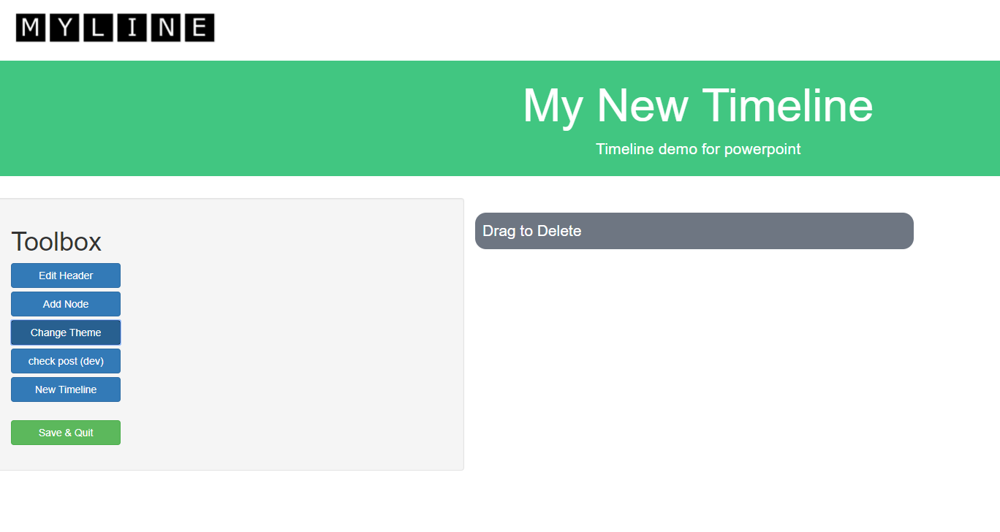
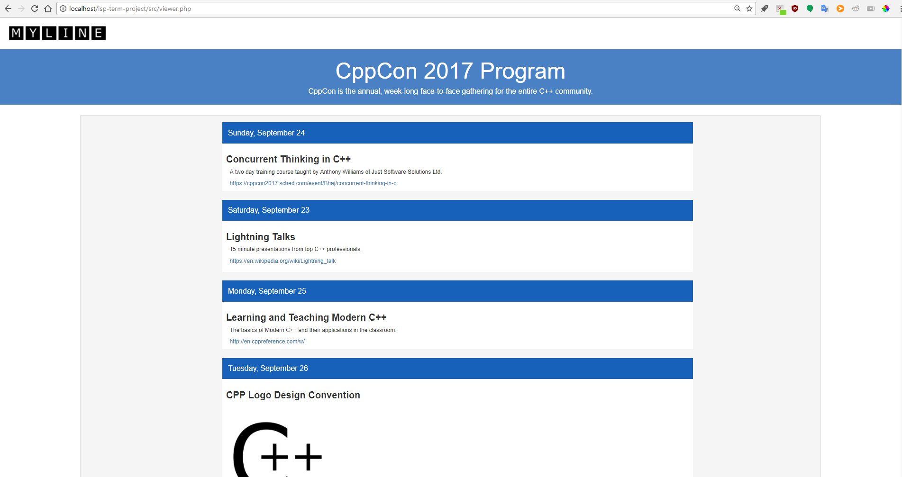

# MyLine - An Interactive Timeline Editor
Internet Systems Programming term project by Orion Davis and Tim Synder

### Introduction
MyLine is an interactive editor that allows uers to edit and view their own custom made timelines.  This application can be used to detail event itineraries, historical events, or other times where a timeline makes communication simple.  The application can be found on Pausch at the link <a href="http://pausch.cs.uakron.edu/~ord4/prj/login.php">http://pausch.cs.uakron.edu/~ord4/prj/login.php</a> (Note: you must be on Univeristy of Akron internet to access this application).

### Implementation
The server side programming for this application was written in PHP due to being quick to getting up and running, and also because it is what the team members had the most experience with.  The server was communicated with when buttons were clicked in the login and registration process.  During this time the server connected with its database to either insert a new user's credentails or to check what the user had entered against the credentials in the database.

The database is a MySQL database which was set up through The Unviersit of Akron's SQL servers available to its Computer Science students.  Specifically this application uses a `users` table located in the database of team member Orion's database.  This table contains a unique id for every user, their username, password (hashed version is stored), and a string called timeline which holds the JSON string for the user's timeline information.

The user interface was marked up using HTML and CSS.  There are various different views for the user and each is represented by different HTML code either living within a PHP file or its own HTML file that is linked to a PHP if need be.  It should be noted that the editor features a dynamic page which was made possible through client-side JavaScript.  The JavaScript written allows for event nodes to be added, reorderd, and removed from the timeline dynamically.  This is the main feature of the application and what allows users to quickly edit their timelines and describe their event in the easiest way possible.

### Screenshots
Below are a series of screenshots of the application's different pages and interfaces.

### Contributions
For the application Tim headed up the design of the editor and how to represent all of its information.  He worked on the user interface and making sure it was simple to use and the user could create new events and move them around as need be.  Tim also designed how the data would be kept so that it could be saved in the database and then retrieved and read when the user logs in to continue editing the timeline.  Tim's work with the editor also included developing a viewer of the user's timeline which they could then screenshot and save an image of.

The login and registration forms were designed by Orion.  He created the interface for the forms and connected them with the database, which he also headed.  Once a new user had registered they were able to login and be routed to the editor to begin editing their timeline.  To be able to do these actions the database needed to be created and connected to within the PHP code to ensure no data is lost between editing sessions.

### Experience Gained
Throughout this project the team learned how to create a full scale web application.  The team learned how to design a database to store different information needed for all of the users and making sure their data is safe.  This project tought the team a few of the basics to storing passwords safely through the process of password hashing.  The team also learned about creating dynamic webpages as is evident in the dynamic editable nature of the timeline editor.  And finally when getting ready to deliver the project the team learned a few things about deploying an application that uses a database and server that must be accessable to other users and not just local to the machine.

### Future Work
To expand this project in the future the team could look to allow users to have more than one timeline in which they can edit and view at the same time rather than just one at a time.  Another possible expansion of the project could be a homepage where the user can view all their timeline and also be able to browse other timelines that users have created an made public.  Finally, and perhaps one of the most important next steps would be to create a version of the timeline that is easily exportable and can be embedded into user's own webpages or other media.